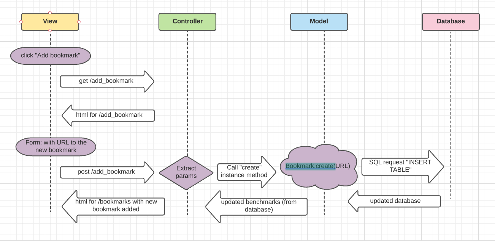

### Setting up the database  
- Connect to psql
- Create the database using the psql command CREATE DATABASE bookmark_manager;
- Connect to the database using the pqsl command \c bookmark_manager;
- Run the query we have saved in the file 01_create_bookmarks_table.sql

### Setting up the TEST database  
- Connect to psql
- Create the database using the psql command CREATE DATABASE bookmark_manager_test;
- Connect to the database using the pqsl command \c bookmark_manager_test;
- Run the query we have saved in the file 01_create_bookmarks_table.sql

### User Story 1

- As a user
- So that I can easily access pages I often visit 
- I'd like to be able to see a list of bookmarks 

### User Story 2
As a user
So that I can easily access new pages I want to often visit (in the future)
I'd like to be able to add new bookmarks to my bookmark manager 

